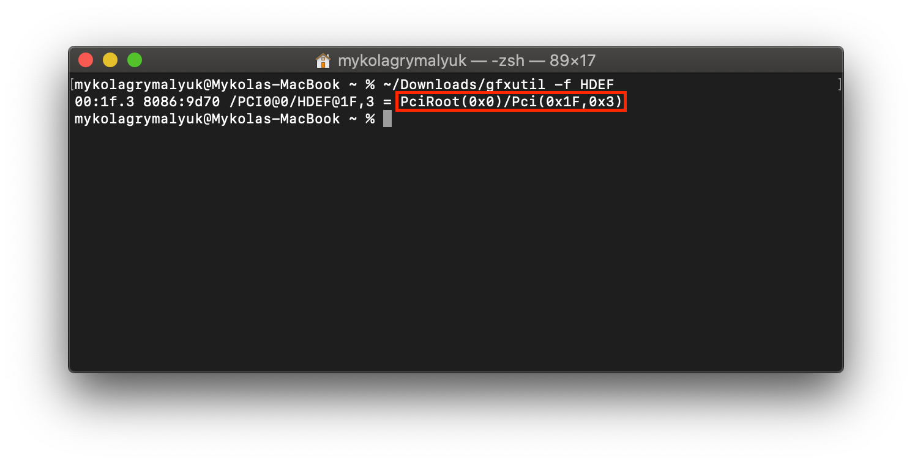
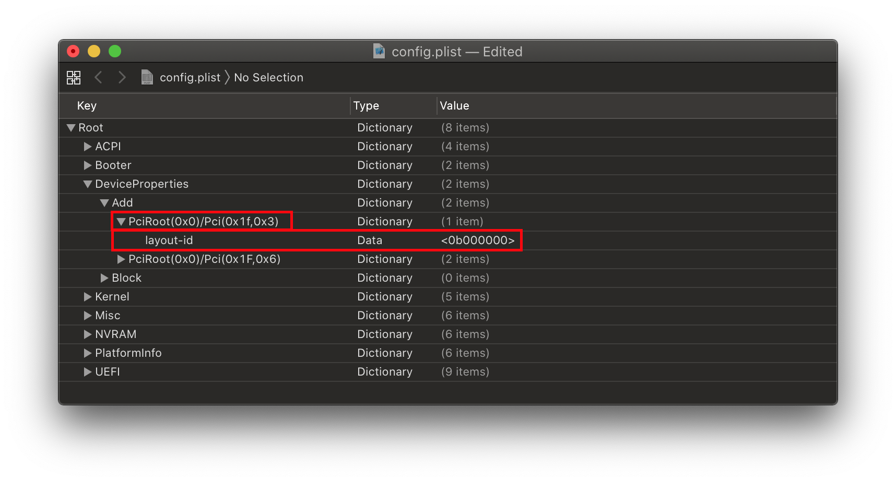
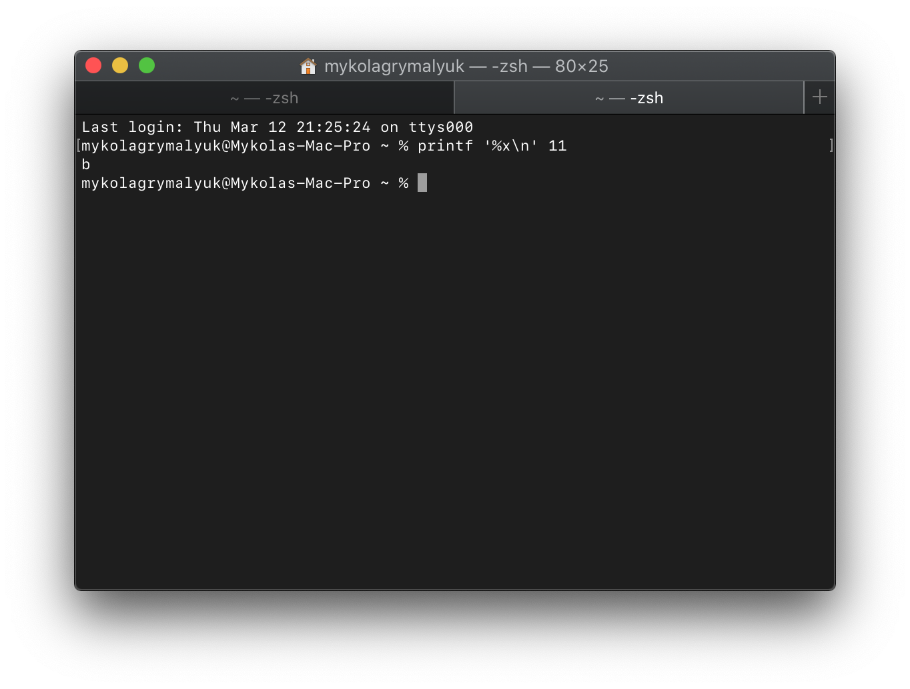
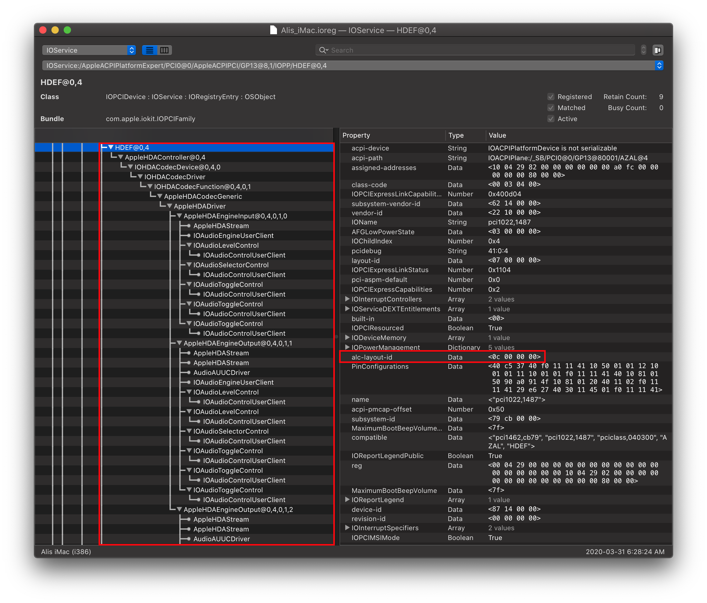
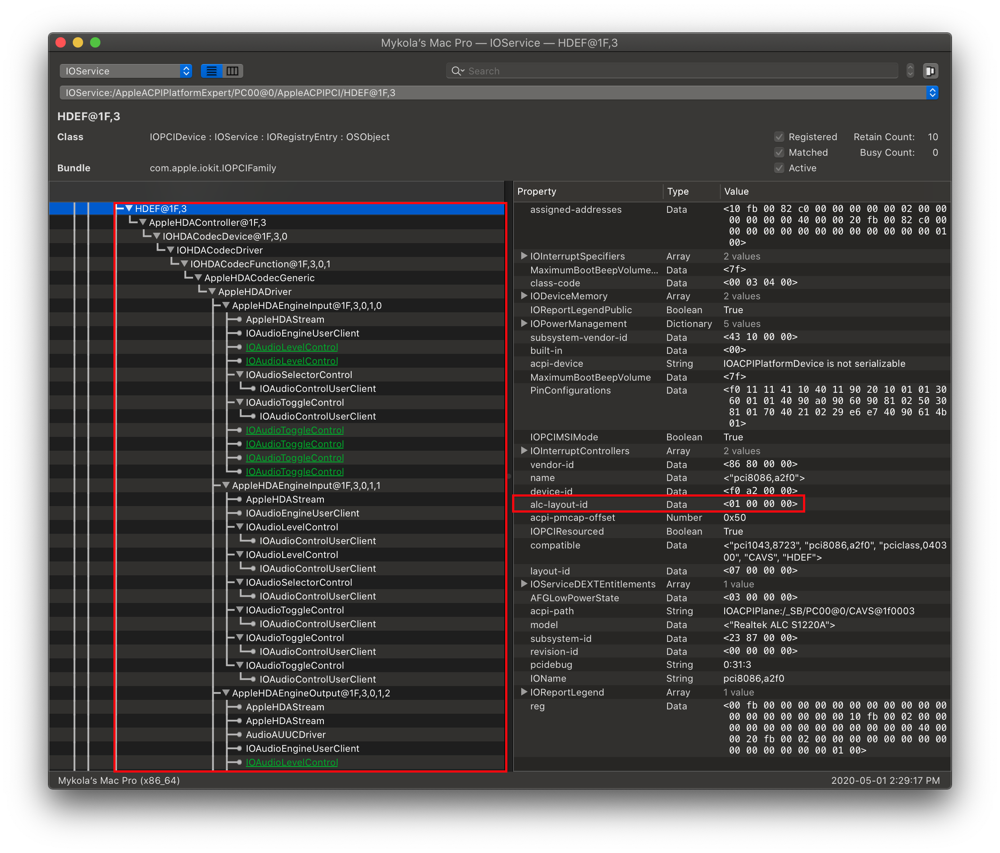
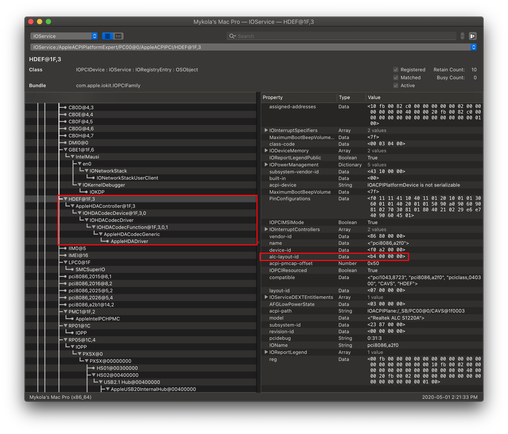
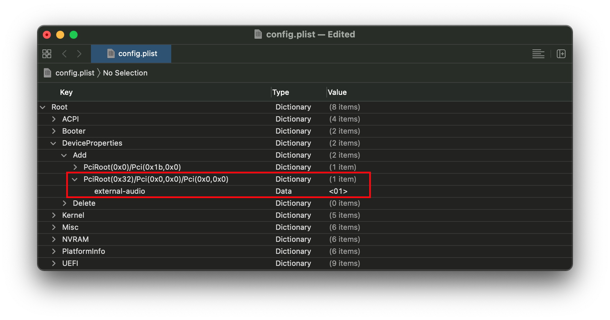

# 用AppleALC修复音频

因此，首先，我们假设您已经安装了Lilu和AppleALC，如果您不确定它是否已正确加载，则可以在终端中运行以下命令（这也将检查AppleHDA是否已加载，因为没有这个AppleALC就没有什么可修补的）：

```sh
kextstat | grep -E "AppleHDA|AppleALC|Lilu"
```

如果3个都出现，您就可以开始了。并确保**不存在**VoodooHDA。否则这将与AppleALC冲突。

如果您遇到问题，请参阅[问题排查部分](../universal/audio.md#troubleshooting)

## 查找你的layout ID

因此，对于此示例，我们假设您的编解码器为ALC1220。要验证您的，您有以下几种选择：

* 检查主板的规格页和手册
* 检查Windows中的“设备管理器”
* 检查Windows下的HWInfo64
  * 确保在打开时取消选择Summary-only和Sensors-only
* 在Windows中检查AIDA64 Extreme
* 在Linux的终端上运行`cat`
  * `cat /proc/asound/card0/codec#0 | less`

现在有了编解码器，我们想交叉引用它与AppleALC支持的编解码器列表:

* [AppleALC支持的编解码器](https://github.com/acidanthera/AppleALC/wiki/Supported-codecs)

使用ALC1220，我们得到以下结果:

```
0x100003, layout 1, 2, 3, 5, 7, 11, 13, 15, 16, 21, 27, 28, 29, 34
```

因此，它告诉我们两件事:

* 支持哪个硬件版本(`0x100003`)，仅在列出具有不同布局的多个版本时相关
* 我们的编解码器支持的layout ID(`layout 1, 2, 3, 5, 7, 11, 13, 15, 16, 21, 27, 28, 29, 34`)

现在有了支持的layout ID列表，我们准备进行一些尝试

**Note**: 如果你的音频编解码器是ALC 3XXX，这很可能是假的，只是一个重新命名的控制器，做你的研究，看看真正的控制器是什么。

* 这方面的一个例子是ALC3601，但是当我们加载Linux时，显示的是真实名称：ALC 671

## 测试你的layout

为了测试我们的layout ID，我们将使用boot-arg`alcid=xxx`，其中xxx是您的layout。记住，**一次**尝试**一个**布局id 。不要添加多个ID或alcid启动参数，如果一个不工作，然后尝试下一个ID等

```
config.plist
├── NVRAM
  ├── Add
    ├── 7C436110-AB2A-4BBB-A880-FE41995C9F82
          ├── boot-args | String | alcid=11
```

如果没有布局ID工作，尝试为您的系统创建[SSDT-HPET修复](https://xuanxuan1231.github.io/Getting-Started-With-ACPI/Universal/irq.html)-AppleHDA为笔记本和一些台式机工作时需要。

## 使layout ID更永久

一旦你找到了一个与你的黑苹果工作的布局ID，我们可以创建一个更永久的解决方案，更接近真实的mac设置他们的布局ID。

在AppleALC中，有一个优先级结构，属性的优先级是这样的:

1. `alcid=xxx` boot-arg，用于调试并覆盖所有其他值
2. `alc-layout-id` 在DeviceProperties,，**应该只在苹果硬件上使用**
3. `layout-id` 在DeviceProperties，**应该在苹果和非苹果硬件上使用**

首先，我们需要找出音频控制器在PCI地图上的位置。为此，我们将使用一个名为[gfxutil](https://github.com/acidanthera/gfxutil/releases)的方便工具，然后在macOS终端上使用:

```sh
path/to/gfxutil -f HDEF
```



然后将这个PciRoot和子配置`layout-id`添加到你的config.plist中DeviceProperties -> Add部分:



请注意，AppleALC可以接受十进制/数字和十六进制/数据，通常最好的方法是十六进制，因为你避免了任何不必要的转换。你可以使用一个简单的[十进制到十六进制计算器](https://www.rapidtables.com/convert/number/decimal-to-hex.html)来找到你的答案。`printf '%x\n' DECI_VAL`:



所以在这个例子中，`alcid=11`可以变成:

* `layout-id | Data | <0B000000>`
* `layout-id | Number | <11>`

请注意，最终的HEX/Data值总共应该是4个字节（ `0B 00 00 00`，对于layout ID超过255（`FF 00 00 00`）将需要记住字节被交换。所以256就变成了`00 01 00 00`

* 使用十进制/数字方法可以完全忽略十六进制交换和数据大小


**提醒**:你之后**必须**删除boot-arg，因为它将始终具有最高优先级，不删除的话AppleALC将忽略所有如DeviceProperties的其他条目

## 其他问题

### AMD上没有麦克风

* 这是与AMD一起运行AppleALC时的常见问题，特别是没有补丁来支持麦克风输入。目前“最好”的解决方案是买一个USB DAC/麦克风。实际上VoodooHDA.kext方法也可以，但VoodooHDA的问题在于它不稳定，音质也比AppleALC差

### Clover中相同的layout ID不在OpenCore上工作

This is likely do to IRQ conflicts, on Clover there's a whole sweep of ACPI hot-patches that are applied automagically. Fixing this is a little bit painful but [SSDTTime](https://github.com/corpnewt/SSDTTime)'s `FixHPET` option can handle most cases.

For odd cases where RTC and HPET take IRQs from other devices like USB and audio, you can reference the [HP Compaq DC7900 ACPI patch](https://github.com/khronokernel/trashOS/blob/master/HP-Compaq-DC7900/README.md#dsdt-edits) example in the trashOS repo

### 在10.15中，电源状态改变导致Kernel Panic

* 在你的config.plist中启用PowerTimeoutKernelPanic：
  * `Kernel -> Quirks -> PowerTimeoutKernelPanic -> True`

## 排错

为了排除故障，我们需要复习几件事:

* [检查你是否有正确的内核扩展](#检查你是否有正确的内核扩展)
* [检查AppleALC补丁是否正确](#检查AppleALC补丁是否正确)
* [检查AppleHDA是否正常](#检查AppleHDA是否正常)
* [AppleALC工作不一致](#applealc工作不一致)
* [AppleALC在多个声卡下不能正常工作](#applealc在多个声卡下不能正常工作)
* [Windows重启后，AppleALC无法工作](#Windows重启后，AppleALC无法工作)

### 检查你是否有正确的内核扩展

首先，我们假设你已经安装了Lilu和AppleALC，如果你不确定它是否被正确加载，你可以在终端运行以下命令(这也会检查AppleHDA是否被加载，因为没有这个AppleALC没有什么可以修补的):

```sh
kextstat | grep -E "AppleHDA|AppleALC|Lilu"
```

如果这三个都出现了，你就可以开始了。确保VoodooHDA **不存在**。否则，这将与AppleALC冲突。需要确保系统中没有以下内核扩展:

* RealtekALC.kext
* CloverALC.kext
* VoodooHDA.kext
* HDA Blocker.kext
* HDAEnabler#.kext(# 可以是1, 2, 或3)

> Lilu和/或AppleALC没有出现

一般来说，最好的开始是查看你的OpenCore日志，看看Lilu和AppleALC是否正确注入:

```
14:354 00:020 OC: Prelink injection Lilu.kext () - Success
14:367 00:012 OC: Prelink injection AppleALC.kext () - Success
```

如果显示注入失败:

```
15:448 00:007 OC: Prelink injection AppleALC.kext () - Invalid Parameter
```

你可以查看原因的主要地方:

* **注入顺序**：确保Lilu在内核扩展中位于AppleALC之上
* **所有内核扩展都是最新的**：对于Lilu插件尤其重要，因为不匹配的文本可能会导致问题

Note: 要设置文件日志记录，请参见[OpenCore调试](https://xuanxuan1231.github.io/OpenCore-Install-Guide/troubleshooting/debug.html).

### 检查AppleALC补丁是否正确

所以在AppleALC中，检查补丁是否正确的最简单方法之一就是查看你的音频控制器是否被正确地命名。抓取[IORegistryExplorer](https://github.com/khronokernel/IORegistryClone/blob/master/ioreg-302.zip)，看看你是否有一个HDEF设备:



从上图中可以看到，我们有以下内容:

* HDEF设备意味着我们的重命名完成了这项工作
* AppleHDAController attached表示苹果的音频内核扩展连接成功
* `alc-layout-id` 是一个属性显示我们的boot-arg/DeviceProperty注入成功
  * 注意：`layout-id | Data | 07000000` 是默认layout， `alc-layout-id` 将覆盖它，并成为AppleHDA将使用的布局

注意:**不要手动重命名您的音频控制器**，这可能会导致问题，因为AppleALC正在尝试修补程序。让苹果去做它的工作。

**更多示例**:

正确的layout-id           |  不正确的layout-id
:-------------------------:|:-------------------------:
  |  

正如你从上面的2中看到的那样，右边的图像缺少了很多AppleHDAInput设备，这意味着AppleALC无法将你的物理端口匹配到它可以理解和输出的东西。这意味着您需要做一些工作来为系统找到正确的布局ID。

### 检查AppleHDA是否正常

这一节主要是有关那些谁是替换库存的AppleHDA与自定义的，这将验证是否你是真正的:

```sh
sudo kextcache -i / && sudo kextcache -u /
```

这将检查签名是否对AppleHDA有效，如果不是，那么你将需要为你的系统获取AppleHDA的原始副本并替换它或更新macOS（更新时将清除内核扩展）。这只会发生在你手动修补AppleHDA时，所以如果这是一个新安装，你不太可能有签名问题。

### AppleALC工作不一致

有时会出现罕见的情况，即您的硬件没有及时初始化AppleHDAController，导致没有声音输出。要解决这个问题，你可以:

在引导参数中指定延迟:

```
alcdelay=1000
```

或者通过DeviceProperties指定(在HDEF设备中):

```
alc-delay | Number | 1000
```

上面的boot-arg/DeviceProperty会使AppleHDAController延迟1000毫秒(1秒)，注意ALC延迟不能超过3000毫秒。(https://github.com/acidanthera/AppleALC/blob/2ed6af4505a81c8c8f5a6b18c249eb478266739c/AppleALC/kern_alc.cpp#L373)

### AppleALC在多个声卡下不能正常工作

对于罕见的情况下，你有2个声卡(例如。板载Realtek和外部PCIe卡)，您可能希望避免AppleALC修补您不使用或不需要修补的设备(如本机PCIe卡)。如果你发现当外部音频控制器存在时，AppleALC不会修补你的板载音频控制器，这一点尤其重要。

为了解决这个问题，我们首先需要确定两个音频控制器的位置。最简单的方法是运行[gfxutil](https://github.com/acidanthera/gfxutil/releases)并搜索PCI ID:

```sh
/path/to/gfxutil
```

现在有了这么大的输出，你会想找到你的PciRoot路径，对于这个例子，让我们使用一个Creative Sound-Blaster AE-9PE PCIe声卡。为此，我们知道PCI ID是`1102:0010`。所以通过gfxutil输出，我们得到了这个:

```
66:00.0 1102:0010 /PC02@0/BR2A@0/SL05@0 = PciRoot(0x32)/Pci(0x0,0x0)/Pci(0x0,0x0)
```

从这里，我们可以清楚地看到我们的PciRoot路径是:

```
PciRoot(0x32)/Pci(0x0,0x0)/Pci(0x0,0x0)
```

* **注意**:这将假设您知道外部声卡的供应商和设备ID。以下是常见的供应商编号，供参考:
  * Creative Labs: `1102`
  * 华硕: `1043`
* **注意2**: 您的ACPI和PciRoot路径看起来会有所不同，因此请注意**您的** gfxutil输出

现在我们有了PciRoot路径，我们终于可以打开我们的config.plist添加我们的补丁。

在DeviceProperties -> Add下，你会想要添加你的PciRoot(作为一个字典)和子调用 `external-audio`:

```
DeviceProperties
| --- > Add
 | --- > PciRoot(0x32)/Pci(0x0,0x0)/Pci(0x0,0x0)
  | ----> external-audio | Data | 01
```



完成后，你可以重新启动，AppleALC现在应该忽略你的外部音频控制器!

### Windows重启后，AppleALC无法工作

如果你发现从Windows重新启动到macOS会中断音频，我们建议在boot-args中添加' alctcsel=1 '，或者在DeviceProperties中为音频设备添加此属性:
```
DeviceProperties
| --- > Add
 | --- > PciRoot(0x32)/Pci(0x0,0x0)/Pci(0x0,0x0)(Adjust to your device)
  | ----> alctcsel | Data | 01000000
```
