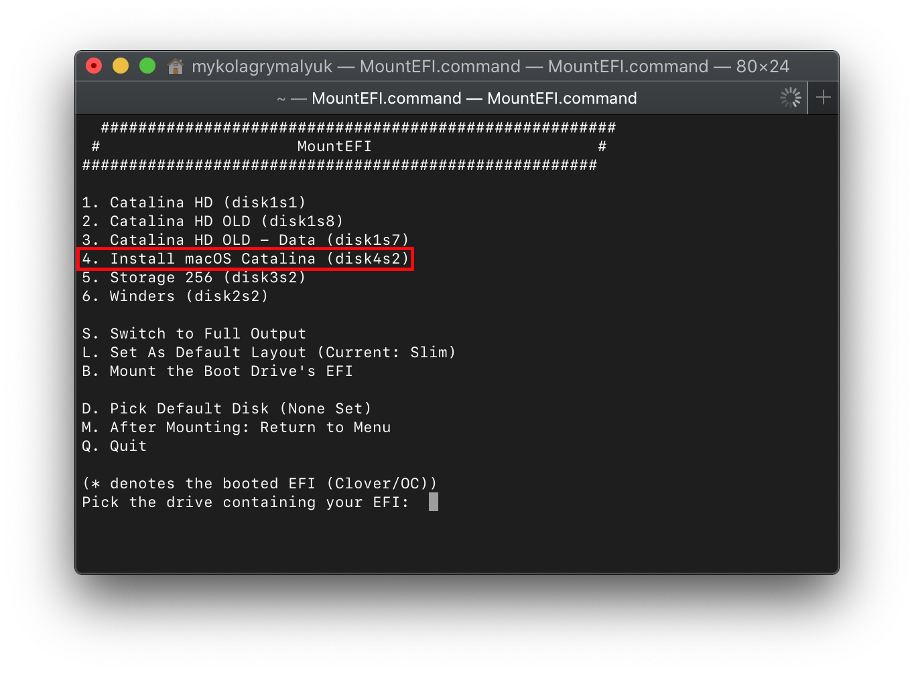
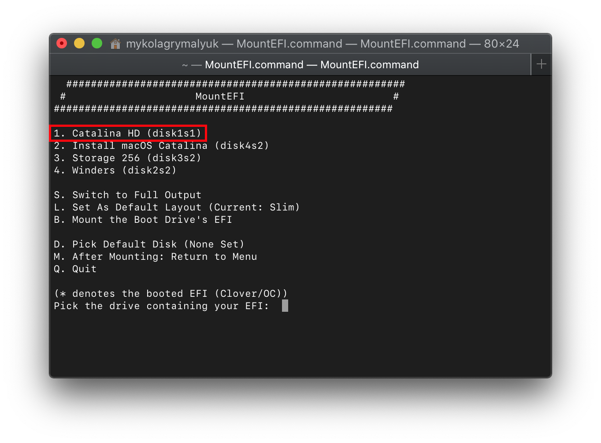
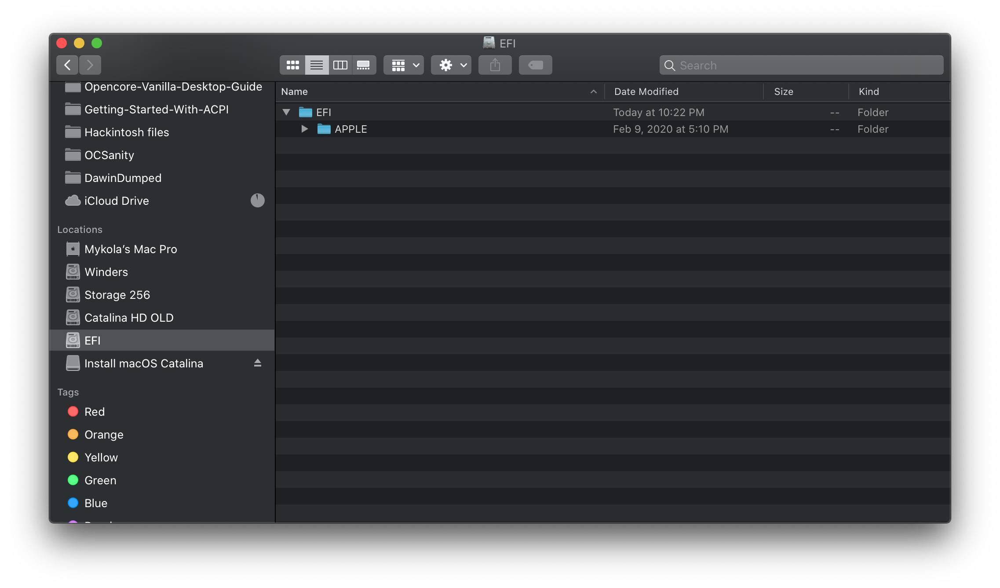

# 将OpenCore从USB移动到硬盘上

## 从USB上抓取OpenCore

首先，我们要从安装程序中获取OpenCore。为了做到这一点，我们将使用CorpNewt的一个简洁的工具，叫做[MountEFI](https://github.com/corpnewt/MountEFI)

对于本例，我们假设您的USB叫做`Install macOS Catalina`:

一旦EFI已装载，我们要找到我们的EFI文件夹在那里，并保持在一个安全的地方。然后我们想要弹出USB驱动器的EFI，因为有多个EFI挂载有时会使macOS感到困惑，最佳做法是一次只挂载1个EFI(你可以只弹出EFI，驱动器本身不需要被移除)

**注**:Windows上使用gibMacOS的MakeInstall.bat制作的安装程序将默认为主引导记录(MBR)分区映射，这意味着没有专用的EFI分区，而不是macOS默认挂载的“Boot”分区。

现在，完成这些后，让我们挂载macOS驱动器。对于macOS Catalina, macOS实际上被划分为2个卷:系统分区和用户分区。这意味着MountEFI可以在它的选择器中报告多个驱动器，但每个分区仍然会共享相同的EFI(UEFI规范只允许每个驱动器1个EFI)。您可以判断它是否与磁盘**X**sY是同一个驱动器(Y只是表示它是哪个分区)。

当你挂载主驱动器的EFI时，你可能会看到一个名为“APPLE”的文件夹，这是用于更新真实mac上的固件，但对我们的硬件没有影响。您可以擦除EFI分区上的所有内容，并将其替换为USB上的分区

## Special notes for legacy users

当转移到您的EFI时，仍然有需要写入的引导扇区，以便您的非uefi BIOS能够找到它。所以不要忘记在macOS驱动器上重新运行[' BootInstallARCH.tool '](https://xuanxuan1231.github.io/OpenCore-Install-Guide/installer-guide/mac-install.html#legacy-setup)。
