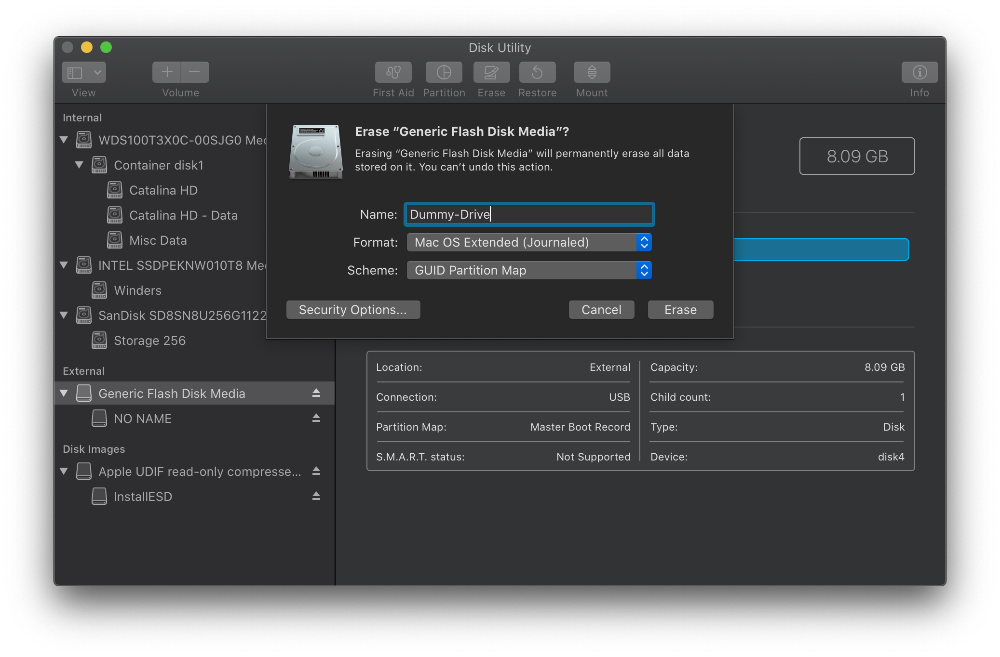
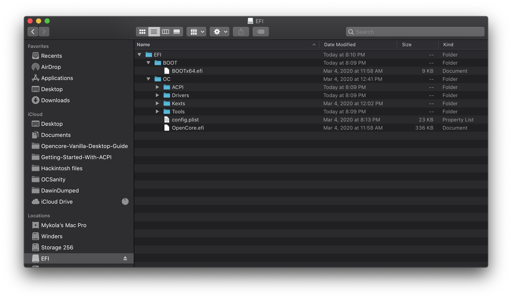
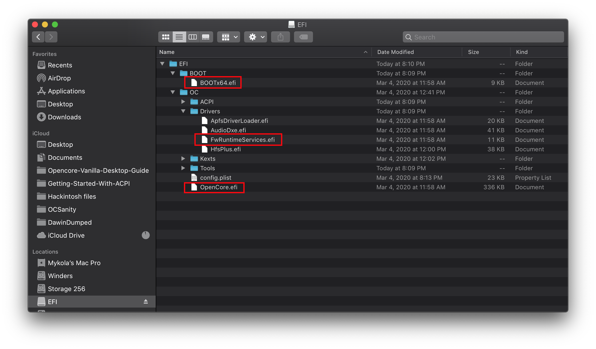
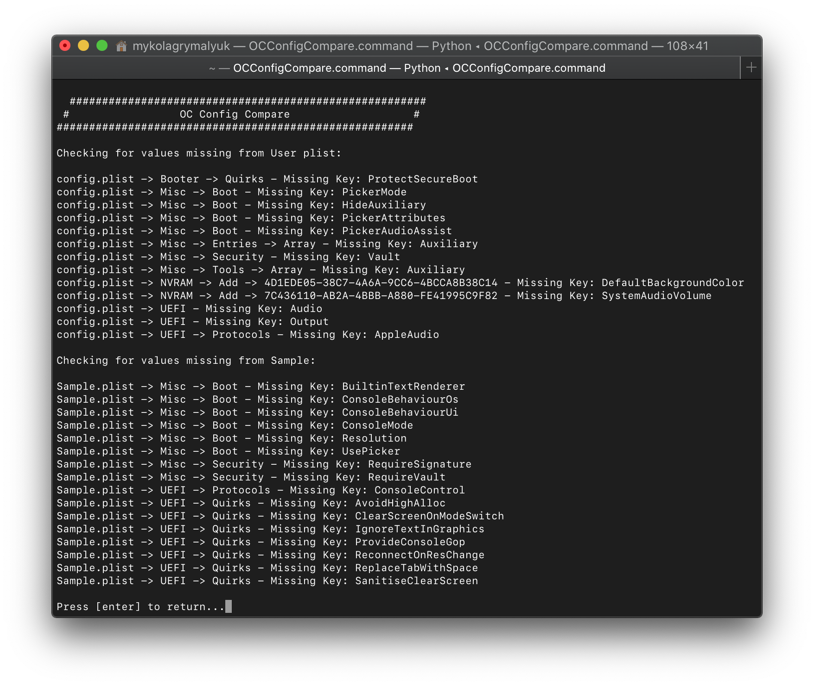
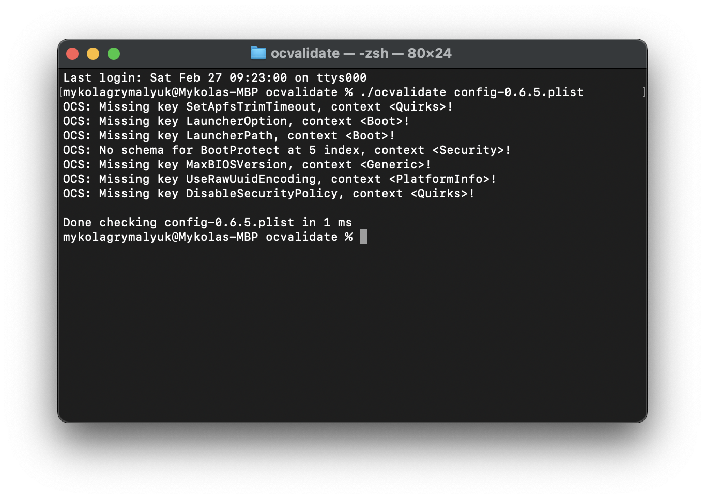

# 升级OpenCore和macOS

## 升级OpenCore

So the main things to note with updating OpenCore:

* 每个月的第一个星期一会有一个新的[Release](https://github.com/acidanthera/OpenCorePkg/releases) 
* [Differences.pdf](https://github.com/acidanthera/OpenCorePkg/blob/master/Docs/Differences/Differences.pdf)将告诉你与以前的版本相比，这个版本的OpenCore添加和删除的所有内容
* OpenCore安装指南将在[header](https://xuanxuan1231.github.io/OpenCore-Install-Guide/)中有一个关于它支持的发行版本的说明

> 如何更新呢?

所以这个过程是这样的:

### 1. **下载最新版本的OpenCore**

* [OpenCorePkg](https://github.com/acidanthera/OpenCorePkg/releases)

### 2. **挂载你的EFI**

* 因此，首先，让挂载您的硬盘驱动器的EFI，并在安全的地方复制[MountEFI](https://github.com/corpnewt/MountEFI)。我们不会首先更新驱动器的EFI，相反，我们将使用一个备用USB作为我们测试使用。这允许我们保留OpenCore的可用副本，以防我们的更新出错

* 对于USB，它必须格式化为GUID。这样做的原因是GUID将自动创建一个EFI分区，尽管默认情况下它是隐藏的，所以您需要使用MountEFI挂载它。

 

* 现在你可以把你的OpenCore EFI放在USB上

 

### 3. **将OpenCore文件替换为刚刚下载的文件**

* 需要更新的重要内容:

  * `EFI/BOOT/BOOTx64.efi`
  * `EFI/OC/OpenCore.efi`
  * `EFI/OC/Drivers/OpenRuntime.efi`(**不要忘记这个，它和OpenCore版本必须匹配，否则不会启动**)

* 你也可以更新你现有的其他驱动程序，这些只是为了正确启动而**必须**更新的驱动程序

### 4. **将你的config.plist与新的Sample.plist进行比较**

* 有几种方法可以做到这一点:

  * [OCConfigCompare](https://github.com/corpnewt/OCConfigCompare) 在样本之间进行比较Sample.plist和config.plist
  * 在终端中使用`diff (file input 1) (file input 2)` 
  * [Meld Merge](https://github.com/yousseb/meld/releases/), [WinMerge](https://winmerge.org/), 或者其他你喜欢的比较软件
  * 根据阅读更新的OpenCore安装指南进行新的配置

* 一旦你做了调整，以确保你的配置符合最新版本的OpenCore，你可以使用OpenCore实用程序ocvalidate:这个工具将帮助确保你的config.plist匹配匹配构建的OpenCore规范。
  * 请注意，`ocvalidate`必须与使用的OpenCore版本匹配，并且可能无法检测到文件中存在的所有配置缺陷。我们建议用OpenCore指南仔细检查您的设置，以设置所有内容，否则请阅读[Differences.pdf](https://github.com/acidanthera/OpenCorePkg/blob/master/Docs/Differences/Differences.pdf)以获取有关更改的更深入的文档。
  * 要运行`ocvalidate`， `cd`进入OpenCore的`Utilities/ocvalidate/`，然后运行`./ocvalidate <insert_config.plist>`。注意，您可能需要运行`chmod +x ocvalidate`来执行它。
  * 此外，更新ProperTree并执行OC快照(Ctrl/Cmd+R)，以确保您的ssdt，驱动程序，文本等的配置项符合OpenCore预期的格式。

### 5. **引导！**

* 一旦虚拟USB正常工作，您就可以挂载EFI并将其移动到硬盘驱动器的EFI分区。记得保留一份你的旧EFI的副本，以防OpenCore在未来的道路上表现得很滑稽

## 更新内核扩展

* 更新内核扩展与更新OpenCore的过程类似，复制所有内容并在虚拟USB上更新，以防出现问题

* 更新内核扩展最简单的方法是通过2个工具:

  * [Lilu and Friends](https://github.com/corpnewt/Lilu-and-Friends) 来下载并编译内核扩展
  * [Kext Extractor](https://github.com/corpnewt/KextExtractor) 将它们合并到你的EFI中

## 更新macOS

* 通过操作系统更新来维护系统可能是最具挑战性的部分之一。要记住的主要事情:
  * 对于操作系统更新，请确保所有内容都已更新，并且您有某种形式的恢复，例如timemmachine或带有已知良好EFI的旧macOS安装程序
  * 做一点谷歌搜索，看看其他人是否有最新的更新问题

* 我还提供了更多macOS版本变化的详细地图，见下文:

**macOS Catalina**:

* 10.15.0
  * [需要proper EC](https://dortania.github.io/Getting-Started-With-ACPI/)
  * 双插槽和大多数AMD cpu需要 [AppleMCEReporterDisabler.kext](https://github.com/acidanthera/bugtracker/files/3703498/AppleMCEReporterDisabler.kext.zip)
  * 丢弃MacPro5,1支持
* 10.15.1
  * 需要WhateverGreen 1.3.4+
  * 许多图形卡的DRM都坏了(查看[DRM图表](https://github.com/acidanthera/WhateverGreen/blob/master/Manual/FAQ.Chart.md))
  * 需要所有以前的修复
* 10.15.2
  * 修复了安装程序中Navi的支持
  * 需要所有以前的修复
* 10.15.3
  * 无修改
  * 需要所有以前的修复
* 10.15.4
  * [AMD CPU 需要更新 `cpuid_set_cpufamily`补丁](https://github.com/AMD-OSX/AMD_Vanilla)
  * 修复了许多基于Ellesmere的Polaris图形卡的DRM
  * 需要所有以前的修复(对于大多数用户来说，Polaris DRM不包括`shikigva=80`)
* 10.15.5
  * UHD 630的帧缓冲区中断了很多，如果你收到黑屏，你可能需要从`07009B3E`切换到`00009B3E`
  * Comet Lake S不再需要CPU ID欺骗
* 10.15.6
  * 无修改
  * 需要10.15.5以前的所有修复程序
* 10.15.7
  * No change
  * 需要10.15.5以前的所有修复程序
  
**macOS Big Sur**:

* 11.0.1
  * 此处：[OpenCore和macOS 11: Big Sur](https://xuanxuan1231.github.io/OpenCore-Install-Guide/extras/big-sur/)

**macOS Monterey**:

* 12.0.1
  * 此处[OpenCore和macOS 12: Monterey](https://xuanxuan1231.github.io/OpenCore-Install-Guide/extras/monterey.html)
